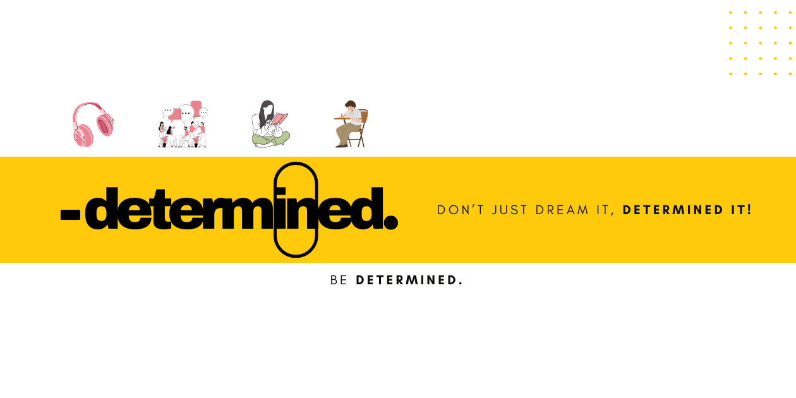

# IELTS-Academic-Masterlist
Practice for IELTS like never before.

Determined IELTS 🎯
Master Your IELTS, Confidently.
Welcome to the Determined IELTS project! This application is designed to be a modern and intuitive platform for students to prepare for the International English Language Testing System (IELTS) exam.

What is Determined IELTS? 🤔
Determined IELTS is a web-based learning application built to provide a focused and engaging preparation experience for the four core modules of the IELTS exam: Reading, Writing, Listening, and Speaking. It features a clean, modern user interface, smooth animations, and a responsive design to ensure a great experience on any device.

Key Features ✨
Modular Learning: The application is structured around the four main IELTS modules, with dedicated pages and content for each.

Modern UI/UX: A sleek and contemporary design with smooth animations using Framer Motion to create a dynamic and enjoyable user experience.

Responsive Design: The layout is fully responsive, adapting seamlessly to desktop, tablet, and mobile screens.

Reusable Components: Key UI elements like the Navbar, Footer, and module Cards are built as reusable components for consistency and easy maintenance.

Seamless Navigation: A unique, responsive Navbar that changes its style on scroll for a polished feel.

Technologies Used 🛠️
This project is built with a modern web development stack:

Next.js: A React framework for building server-rendered and statically generated web applications.

React: A JavaScript library for building user interfaces.

Styled-Components: A CSS-in-JS library for writing component-level styles.

Framer Motion: A library for adding animations and gestures to React components.

How to Run the Project Locally 🚀
Follow these steps to set up and run the project on your local machine.

Prerequisites
Make sure you have Node.js and a package manager (npm or yarn) installed.

Installation
Clone the repository to your local machine.

Navigate to the project directory in your terminal.

Install the required dependencies:

npm install
# or
yarn install

Development Server
Once the dependencies are installed, you can start the development server:

npm run dev
# or
yarn dev

The application will be running at http://localhost:3000. Any changes you make to the code will be reflected automatically in your browser.

Project Structure 📂
This project follows the standard Next.js directory structure with a few additions:

pages/: Contains the main application pages (index.js, reading.js, writing.js, etc.).

components/: Holds all the reusable React components (Navbar.js, Footer.js, Card.js).

public/: For static assets like images and fonts.

_document.js: Custom configuration for server-side rendering with styled-components.

Next Steps & Improvements 💡
Create Sub-Pages: Build out the content pages for each module, such as /reading/passages or /listening/section1.

Add Functionality: Implement interactive features like audio players for the listening section or text editors for writing practice.

Introduce State Management: Integrate a state management library like Redux or Zustand for more complex features.

Enhance UI/UX: Explore adding more animations, transitions, and accessibility features.
## *Built with ❤️ for achivers by Ahmad.*
